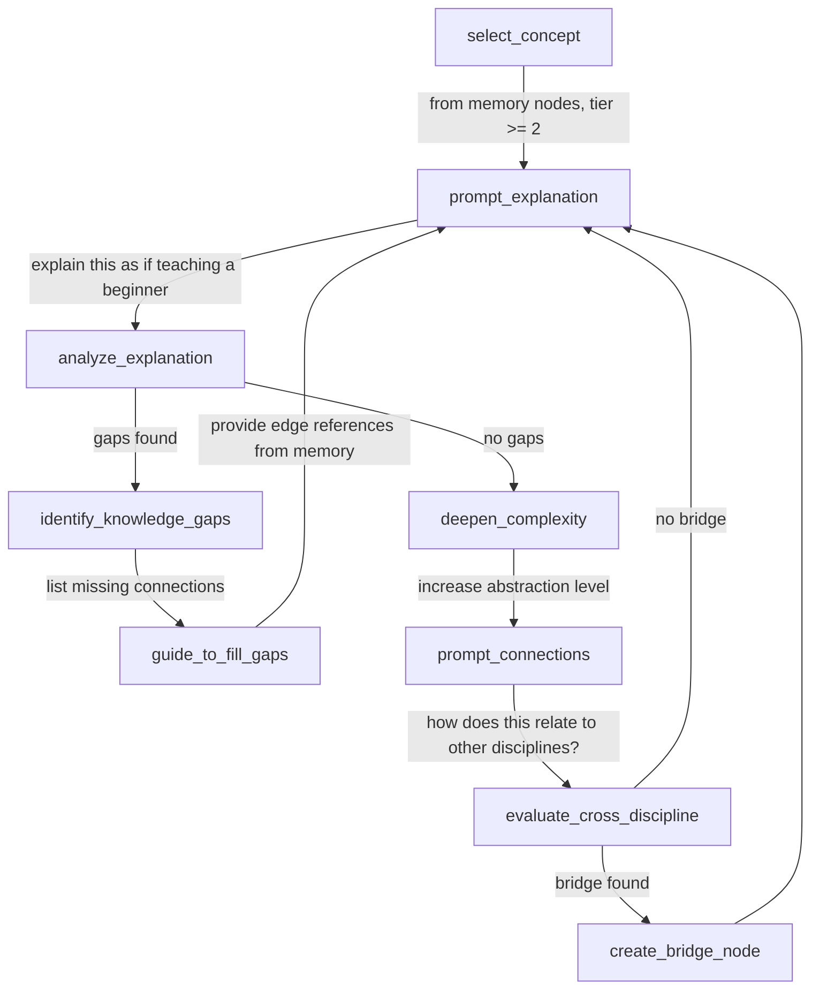

```mermaid
graph TD
    A[select_concept] -->|"from memory nodes, tier >= 2"| B[prompt_explanation]
    B -->|"explain this as if teaching a beginner"| C[analyze_explanation]
    C -->|"gaps found"| D[identify_knowledge_gaps]
    C -->|"no gaps"| E[deepen_complexity]
    D -->|"list missing connections"| F[guide_to_fill_gaps]
    F -->|"provide edge references from memory"| B
    E -->|"increase abstraction level"| G[prompt_connections]
    G -->|"how does this relate to other disciplines?"| H[evaluate_cross_discipline]
    H -->|"bridge found"| I[create_bridge_node]
    H -->|"no bridge"| B
    I --> B
```
