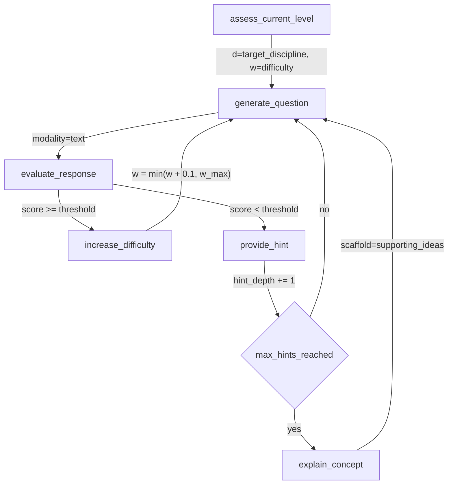

```mermaid
graph TD
    A[assess_current_level] -->|"d=target_discipline, w=difficulty"| B[generate_question]
    B -->|"modality=text"| C[evaluate_response]
    C -->|"score >= threshold"| D[increase_difficulty]
    C -->|"score < threshold"| E[provide_hint]
    E -->|"hint_depth += 1"| F{max_hints_reached}
    F -->|"no"| B
    F -->|"yes"| G[explain_concept]
    G -->|"scaffold=supporting_ideas"| B
    D -->|"w = min(w + 0.1, w_max)"| B
```
