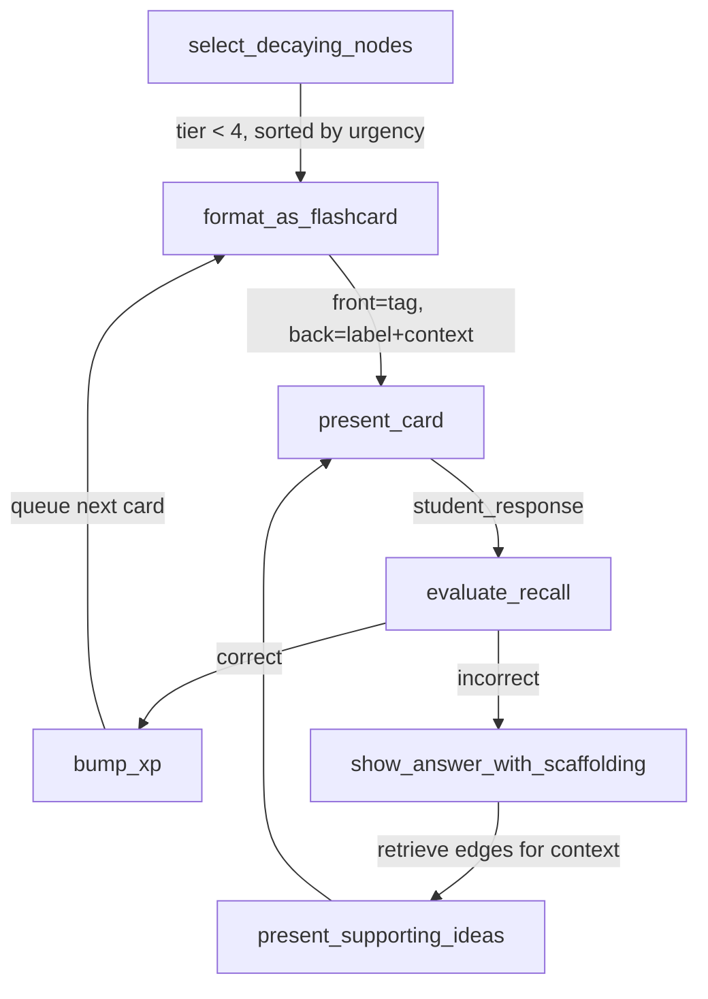

```mermaid
graph TD
    A[select_decaying_nodes] -->|"tier < 4, sorted by urgency"| B[format_as_flashcard]
    B -->|"front=tag, back=label+context"| C[present_card]
    C -->|"student_response"| D[evaluate_recall]
    D -->|"correct"| E[bump_xp]
    D -->|"incorrect"| F[show_answer_with_scaffolding]
    F -->|"retrieve edges for context"| G[present_supporting_ideas]
    G --> C
    E -->|"queue next card"| B
```
